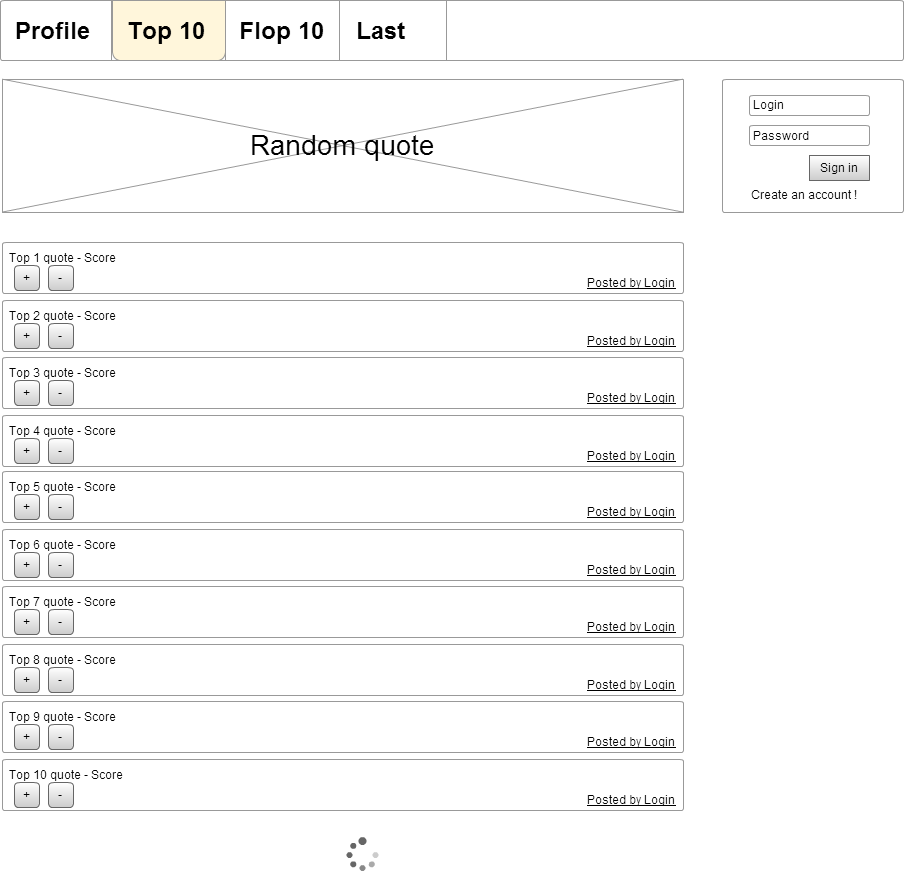
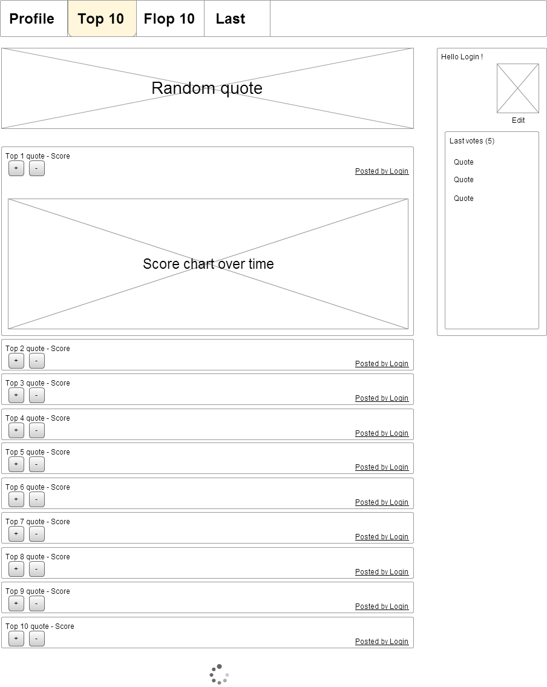

# Read Me
This is a test task - Springboot RestAPI for Collection of quotations service

# Objective
Implement a REST API for the web interface in the two wireframes below.

### The API should allow:
* Creation of a user account (deletion and other CRUD operations not requested). 
* User properties are name, email, password and date of creation;
* Addition, viewing (including a method to get a random quote), modification, and deletion of quotes (real deletion from the database, not just via an archive flag). 
* Quote properties include content, date of creation / update, link to user who posted it, link to votes;
* Voting on quotes (either upvote or downvote);
* View of the top and worse 10 quotes, the details of each quote.
---
* Use Java and Spring Boot.
* Use any in-memory database (Derby, H2, SQLite);
* Project should have docker-compose.yaml for local deploy;

## Used stack:
* Java 17
* Springboot
* Spring Web
* Spring Data
* Maven
* H2 Database
* Docker

# Getting Started
* Download a project
* Run follow command in console (installed docker required)
* 
        docker-compose up

# How to test
You can use attached QuoteCollector Collection for Postman what contain all available requests with examples and descriptions.

Navigate to http://localhost:8080/h2-console to look inside db, login with follow properties
- JDBC URL: jdbc:h2:mem:testdb
- username: sa
- password: 